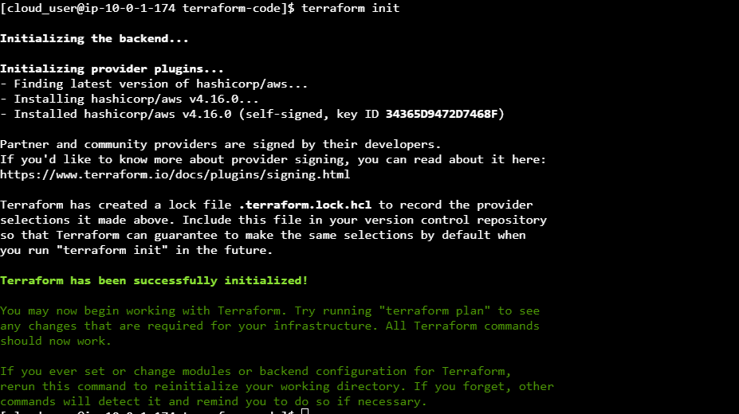
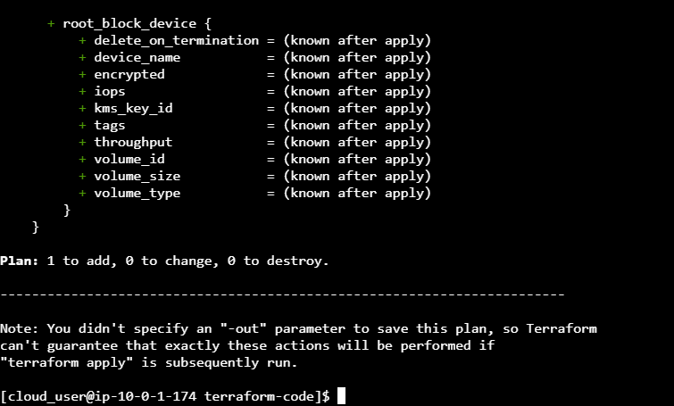
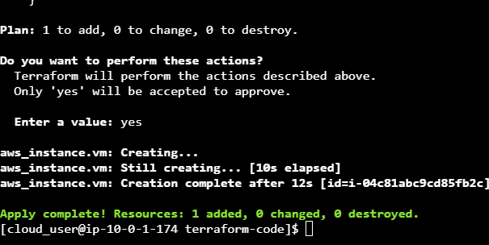

# lab-1: Deploying a VM in AWS Using the Terraform Workflow

#### step-1: Create a Directory and Write Your Terraform Code (Write)
Create a new directory in the home directory called terraform_code using the command `mkdir terraform-code`
Switch to the new directory using the command `cd terraform-code`
Create a new file main.tf using the command `vim main.tf` and paste the following code.
```provider "aws" {
  region = "us-east-1"
}
resource "aws_instance" "vm" {
  ami           = "DUMMY_VALUE_AMI_ID"
  subnet_id     = "DUMMY_VALUE_SUBNET_ID"
  instance_type = "t3.micro"
  tags = {
    Name = "my-first-tf-node"
  }
}
```
Change the ami and subnet_id values as per the requirment

Initialize the Terraform configuration and download the required providers using the command `terraform init`.

Review the actions that will be performed when you deploy your code using the command `'terraform plan`.

Deploy the code by using the command `terraform apply`.

Verify that the resource was created correctly in the AWS Management Console.

