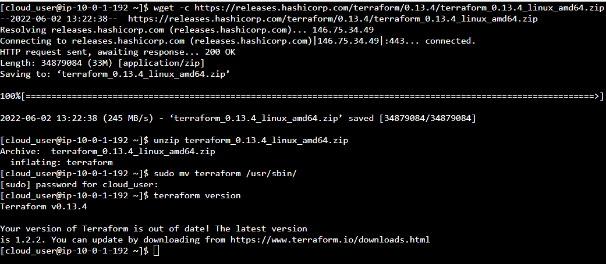
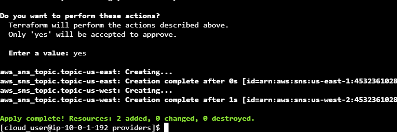
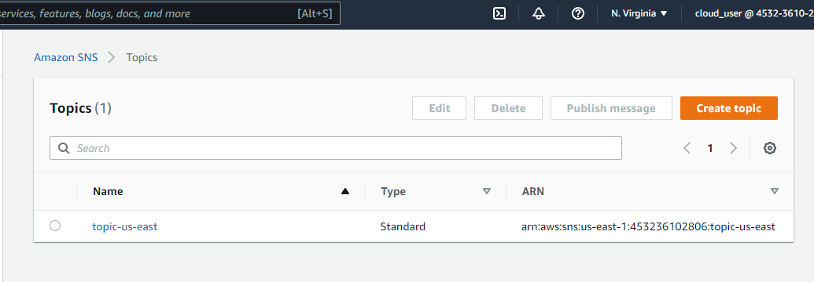

# Installing Terraform and Working with Terraform Providers
#### step-1: Download And Manually Install the Terraform Binary
Download the appropriate Terraform binary package using the wget command:
`wget -c https://releases.hashicorp.com/terraform/0.13.4/terraform_0.13.4_linux_amd64.zip`

Unzip the downloaded file, using the command `unzip terraform_0.13.4_linux_amd64.zip`.

Place the Terraform binary in the PATH of the VM operating system so the binary is accessible system-wide to all users by running the command `sudo mv terraform /usr/sbin/`

Check the terraform version, using the command `terraform version`.



#### step-2: Clone Over Code for Terraform Providers

Create a provider directory: `mkdir provider`.

Move to the providers directory, using the command `cd providers`.

Create a file main.tf and paste the following code:
```
provider "aws" {
  alias  = "us-east-1"
  region = "us-east-1"
}

provider "aws" {
  alias  = "us-west-2"
  region = "us-west-2"
}


resource "aws_sns_topic" "topic-us-east" {
  provider = aws.us-east-1
  name     = "topic-us-east"
}

resource "aws_sns_topic" "topic-us-west" {
  provider = aws.us-west-2
  name     = "topic-us-west"
}
```

#### step-4: Deploy the code

Initialize the working directory using the command `terraform init`.

Review the actions performed using the command `terraform plan`.

Deplo the code using the command`terraform apply`. When prompted, type yes and press Enter.


verify that the resources were created within the AWS Management Console:



