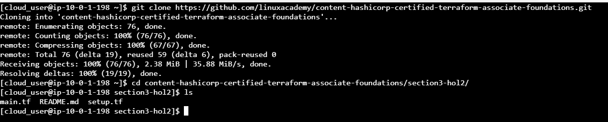
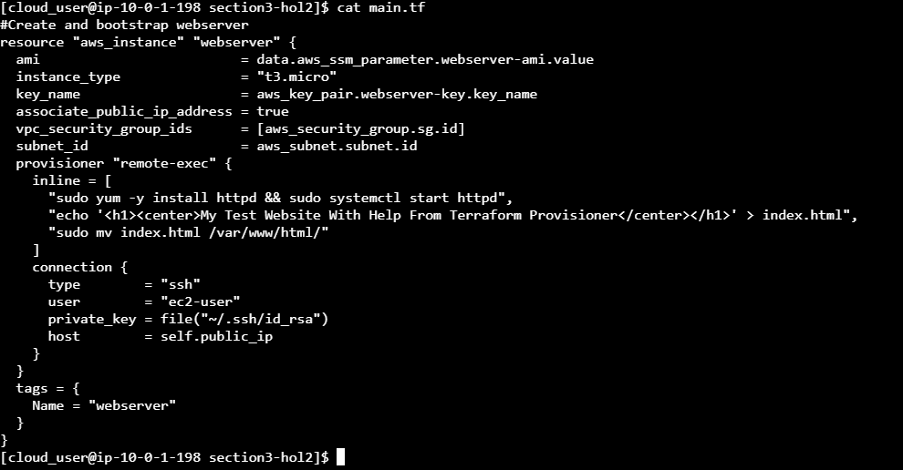
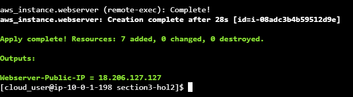
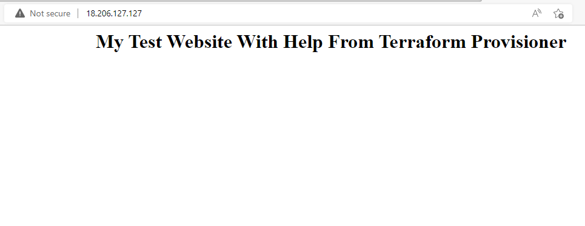

#       Using Terraform Provisioners to Set Up an Apache Web Server on AWS
#### step-1: Clone Terraform Code and Switch to the Proper Directory
Clone the required code from the provided repository:
`git clone https://github.com/linuxacademy/content-hashicorp-certified-terraform-associate-foundations.git`.
Switch to the directory where the code is located: `cd content-hashicorp-certifie`
The files in the directory should include main.tf, README.md, and setup.tf

View the contents of the main.tf file using the cat command: `cat main.tf`

#### step-2: Examine the Code in the main.tf File
Examine the code in the provisioner block and note the following:

The remote-exec keyword tells us that this is a remote provisioner, which invokes a script on a remote resource after it is created.

The provisioner is using the parameters configured in the embedded connection block to connect to the AWS EC2 instance being created.

The provisioner will then issue the commands configured in the inline block to install Apache webserver on CentOS through the yum package manager, start up the Apache server, create a single web page called My Test Website With Help From Terraform Provisioner as an index.html file, and move that file into the data directory of the webserver to be served out globally.

#### step-3: Deploy the Code and Access the Bootstrapped Webserver.
Initialize the Terraform working directory, and download the required providers: `terraform init`.

Review the actions that will be performed when you deploy the Terraform code: `terraform plan`.

Deploy the code: `terraform apply`.

When prompted, type yes, and press Enter.

When complete, it will output the public IP for the Apache webserver as the Webserver-Public-IP value.

Copy the IP address, and browse it in the new browser.

