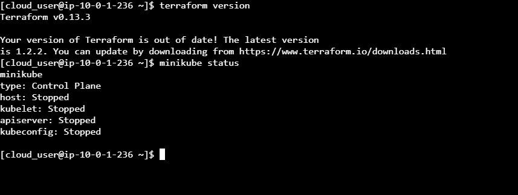
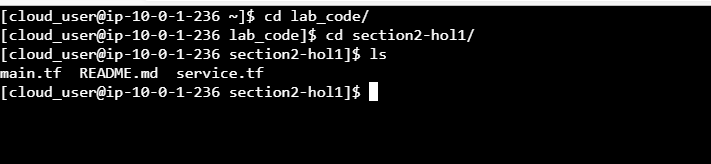
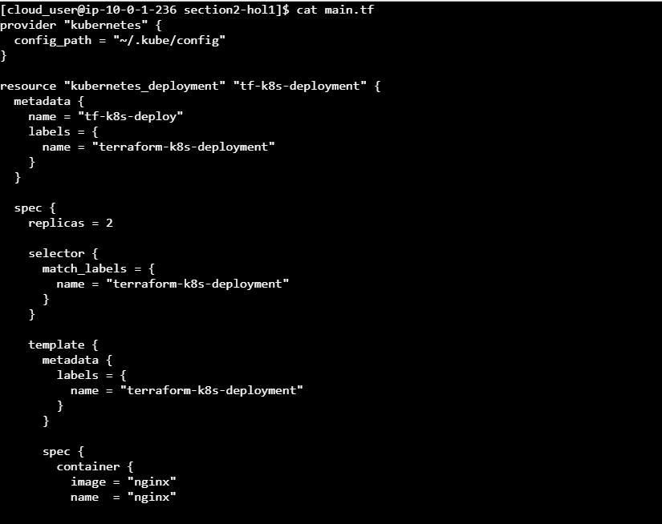
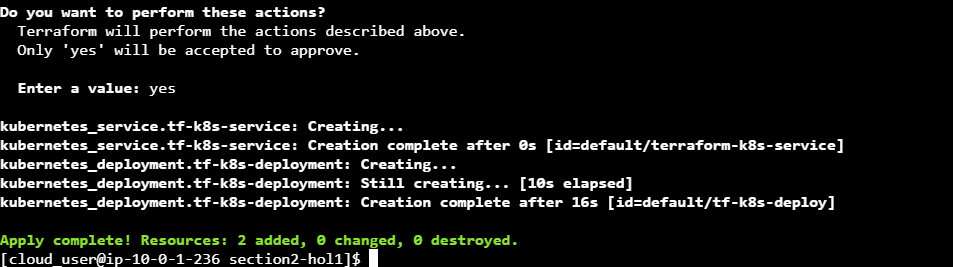
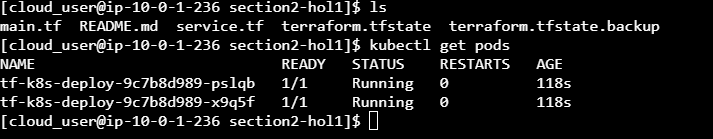
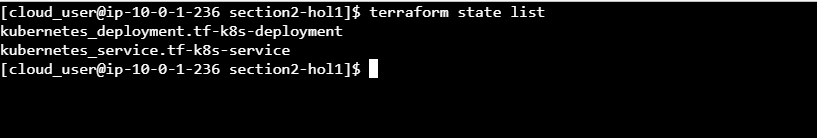
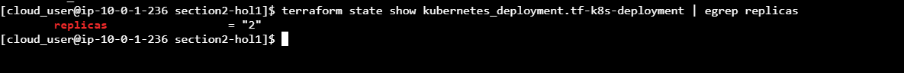
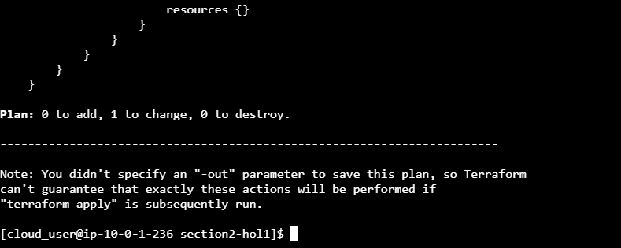

#    Exploring Terraform State Functionality
#### step-1: Check Terraform and Minikube Status

Check that Terraform is installed and functioning properly using the `terraform version` command.
Check that the Kubernetes backedn process minikube is running properly using the `minikube status` command.

#### step-2: Clone Terraform Code

clone the terraform code using the comamnd `git clone https://github.com/linuxacademy/content-hashicorp-certified-terraform-associate-foundations.git`.

Switch to the directory where the code is located: `cd lab_code/section2-hol1/`.

check the content of 'main.tf' file.

#### step-3: Deploy the Terraform Code

Initialize the working directory and download the required providers using the command `terraform init`.

Review the actions that will be performed when you deploy the Terraform code using the command `terraform plan`.

Deploy the code using the command `terraform apply`.

When prompted, type yes and press Enter.

Once the code has executed successfully, list the files in the directory:

Notice that the terraform.tfstate file is now listed. This state file tracks all the resources that Terraform has created.

Verify that the pods required were created by the code as configured using kubectl `kubectl get pods`.

There are currently 2 pods in the deployment.

List all the resources being tracked by the Terraform state file using the terraform state command:

terraform state list
There are two resources being tracked: kubernetes_deployment.tf-k8s-deployment and kubernetes_service.tf-k8s-service

View the replicas attribute being tracked by the Terraform state file using the command `terraform state show kubernetes_deployment.tf-k8s-deployment | egrep replicas`.

open the main.tf file and change the integer from '2' to '4'.

Review the actions that will be performed when you deploy the Terraform code using the command `terraform plan`.
In this case, 1 resource will change: the kubernetes_deployment.tf-k8s-deployment resource for which we have updated the replicas attribute in our Terraform code.

Deploy the code again, using the command `terraform apply`.

View the replicas attribute being tracked by the Terraform state file again.

Now, there are 4 replicas being tracked by the Terraform state file. It is accurately tracking all changes being made to the Terraform code.

