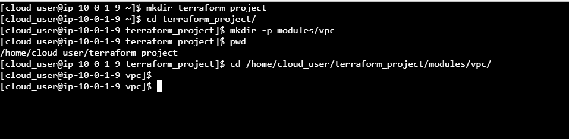

# Building And Testing a Basic Terraform Module
#### step-1: Create the Directory Structure for the Terraform Project
Create a new directory called terraform_project using the command `mkdir terraform_project`.

Switch to this main directory using the command `cd terraform_project`.

Create a custom directory called 'modules' and a directory inside it called 'vpc' by running the command `mkdir -p modules/vpc`.

Switch to the vpc directory using the absolute path: `cd /home/cloud_user/terraform_project/modules/vpc/`.



#### step-2: Write Terraform VPC Module Code
Using Vim, create a new file called main.tf: `vim main.tf` 

Paste the code in that file
```
provider "aws" {
  region = var.region
}

resource "aws_vpc" "this" {
  cidr_block = "10.0.0.0/16"
}

resource "aws_subnet" "this" {
  vpc_id     = aws_vpc.this.id
  cidr_block = "10.0.1.0/24"
}

data "aws_ssm_parameter" "this" {
  name = "/aws/service/ami-amazon-linux-latest/amzn2-ami-hvm-x86_64-gp2"
}
```

Create an another file named 'variables.tf' and paste the following code into it.
```
variable "region" {
  type    = string
  default = "us-east-1"
}
```

Create another new file named 'outputs.tf' and paste the following code into it.
```
output "subnet_id" {
  value = aws_subnet.this.id
}

output "ami_id" {
  value = data.aws_ssm_parameter.this.value
}
```

#### step-3: Write main terraform project code.

Switch to the main directory using the command `cd ~/terraform_project`.

Create a new file called 'main.tf' and paste the following code in the file:
```
variable "main_region" {
  type    = string
  default = "us-east-1"
}

provider "aws" {
  region = var.main_region
}

module "vpc" {
  source = "./modules/vpc"
  region = var.main_region
}

resource "aws_instance" "my-instance" {
  ami           = module.vpc.ami_id
  subnet_id     = module.vpc.subnet_id
  instance_type = "t2.micro"
}
```

Create another file named 'outputs.tf' and paste the following code in the file:
```
output "PrivateIP" {
  description = "Private IP of EC2 instance"
  value       = aws_instance.my-instance.private_ip
}
```

#### step-4: Deploy the Code and Test Out Your Module
Initialize the Terraform configuration to fetch any required providers and get the code being referenced in the module block, using the command `terraform init`.

Review the actions that will be performed when you deploy the Terraform code, using the command `terraform plan`.

Deploy the code, using the command `terraform apply`.

Once the code has executed successfully, note in the output that 3 resources have been created and the private IP address of the EC2 instance is returned 
as was configured in the outputs.tf file in your main project code.

.

View all of the resources that Terraform has created and is now tracking in the state file by running the command `terraform state list`.
The list of resources should include your EC2 instance, which was configured and created by the main Terraform code, and 3 resources with 
module.vpc in the name, which were configured and created via the module code.

.
