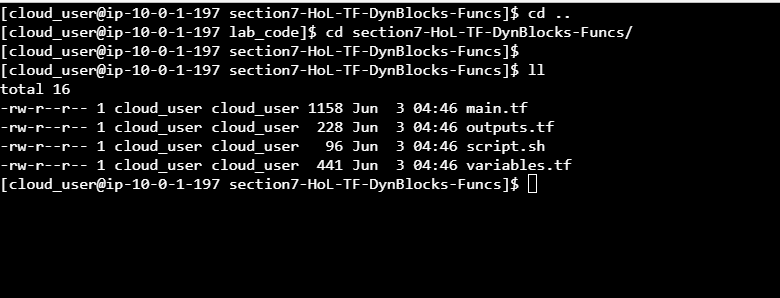
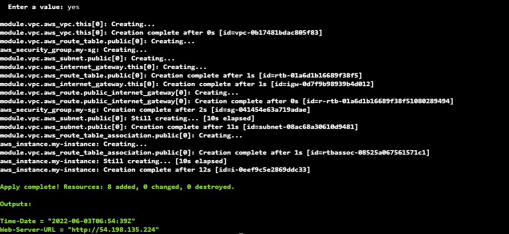
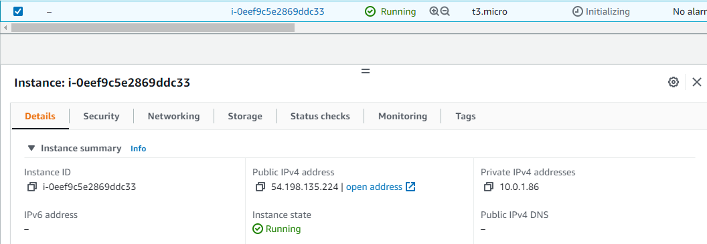

# Using Terraform Dynamic Blocks and Built-in Functions to Deploy to AWS
#### step-1: Clone Terraform Code and Switch to Proper Directory
Clone the terraform code required for this lab from the git repo using the command `git clonehttps://github.com/linuxacademy/content-hashicorp-certified-terraform-associate-foundations.git`

Switch to the directory where the code is located: `cd section7-HoL-TF-DynBlocks-Funcs`.

List the files in the directory. The files in the directory should include 'main.tf', 'outputs.tf', 'variables.tf', and 'script.sh'.



#### step-2: Examine the code in the files
View the content of main.tf file:
```
provider "aws" {
  region = "us-east-1"
}

data "aws_ssm_parameter" "ami_id" {
  name = "/aws/service/ami-amazon-linux-latest/amzn2-ami-hvm-x86_64-gp2"
}


module "vpc" {
  source = "terraform-aws-modules/vpc/aws"

  name = "my-vpc"
  cidr = "10.0.0.0/16"

  azs            = ["us-east-1a"]
  public_subnets = ["10.0.1.0/24"]


}


resource "aws_security_group" "my-sg" {
  vpc_id = module.vpc.vpc_id
  name   = join("_", ["sg", module.vpc.vpc_id])
  dynamic "ingress" {
    for_each = var.rules
    content {
      from_port   = ingress.value["port"]
      to_port     = ingress.value["port"]
      protocol    = ingress.value["proto"]
      cidr_blocks = ingress.value["cidr_blocks"]
    }
  }
  egress {
    from_port   = 0
    to_port     = 0
    protocol    = "-1"
    cidr_blocks = ["0.0.0.0/0"]
  }

  tags = {
    Name = "Terraform-Dynamic-SG"
  }
}

resource "aws_instance" "my-instance" {
  ami             = data.aws_ssm_parameter.ami_id.value
  subnet_id       = module.vpc.public_subnets[0]
  instance_type   = "t3.micro"
  security_groups = [aws_security_group.my-sg.id]
  user_data       = fileexists("script.sh") ? file("script.sh") : null
}
```

The main.tf file spins up AWS networking components such as a virtual private cloud (VPC), security group, internet gateway, route tables, and an EC2 instance bootstrapped with an Apache webserver which is publicly accessible.

examine the code and note the following:
- We have selected AWS as our provider and our resources will be deployed in the us-east-1 region.
- We are using the ssm_parameter public endpoint resource to get the AMI ID of the Amazon Linux 2 image that will spin up the EC2 webserver.
- We are using the vpc module (provided by the Terraform Public Registry) to create our network components like subnets, internet gateway, and route tables.
- For the security_group resource, we are using a dynamic block on the ingress attribute to dynamically generate as many ingress blocks as we need. The dynamic block includes the var.rules complex variable configured in the variables.tf file.
- We are also using a couple of built-in functions and some logical expressions in the code to get it to work the way we want, including the join function for the name attribute in the security group resource, and the fileexists and file functions for the user_data parameter in the EC2 instance resource.

view the content of variables.tf file:
```
variable "rules" {
  type = list(object({
    port        = number
    proto       = string
    cidr_blocks = list(string)
  }))
  default = [
    {
      port        = 80
      proto       = "tcp"
      cidr_blocks = ["0.0.0.0/0"]
    },
    {
      port        = 22
      proto       = "tcp"
      cidr_blocks = ["0.0.0.0/0"]
    },
    {
      port        = 3689
      proto       = "tcp"
      cidr_blocks = ["6.7.8.9/32"]
    }
  ]
}
```

View the contents of scripts.sh file:
```
#!/bin/bash
sudo yum -y install httpd
sudo systemctl start httpd && sudo systemctl enable httpd
```
The script.sh file is passed into the EC2 instance using its user_data attribute and the fileexists and file functions (as you saw in the main.tf file), which then installs the Apache webserver and starts up the service.

View the contents of outputs.sh file:
```
output "Web-Server-URL" {
  description = "Web-Server-URL"
  value       = join("", ["http://", aws_instance.my-instance.public_ip])
}

output "Time-Date" {
  description = "Date/Time of Execution"
  value       = timestamp()
}
```

The outputs.tf file returns the values we have requested upon deployment of our Terraform code.

The Web-Server-URL output is the publicly accessible URL for our webserver. Notice here that we are using the join function for the value parameter to generate the URL for the webserver.

The Time-Date output is the timestamp when we executed our Terraform code.

#### step3: Review and Deploy the Terraform Code
Initialize the working directory and download the required providers, using the command `terraform init`.

Review the actions that will be performed when you deploy the Terraform code, using the command `terraform plan`.

Deploy the code, using the command `terraform apply`.



Verify that the resources were created correctly in the AWS Management Console




