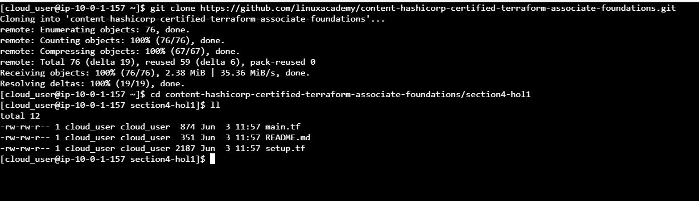
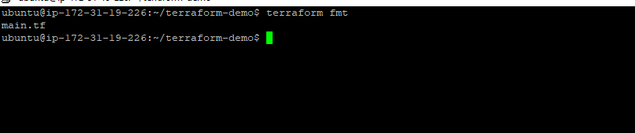
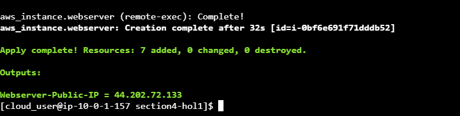
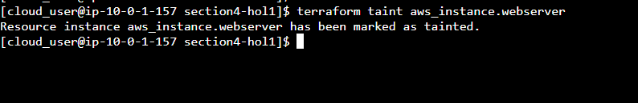
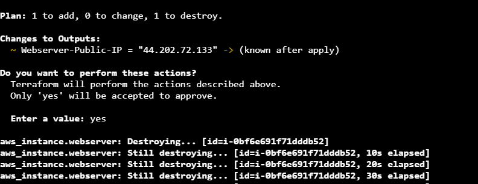
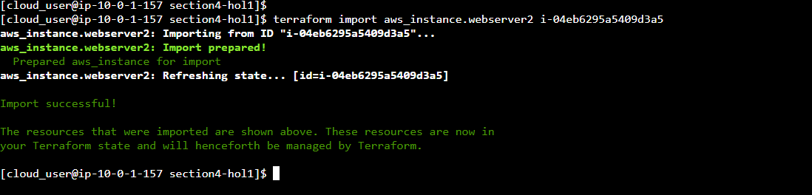
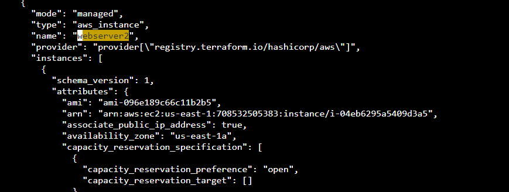

#  Practicing Terraform CLI Commands (fmt, taint, and import)
#### step-1: Clone Terraform Code and Switch to the Proper Directory
Clone the required code from the given repository using the command `git clone https://github.com/linuxacademy/content-hashicorp-certified-terraform-associate-foundations.git`

Switch to the directory where the code is located, using the command `cd content-hashicorp-certified-terraform-associate-foundations/section4-hol1`

List the files in the directory:

The files in the directory should include main.tf, README.md, and setup.tf. The main.tf file contains the code used to spin up an AWS EC2 instance 
(virtual machine) and the setup.tf contains the code for the resources that support the creation of the VM.


#### step-2: Use the fmt Command to Format Any Unformatted Code Before Deployment
View the contents of the main.tf file using the cat command:


Notice that the code in the file is pretty messy and improperly formatted, with issues like inconstent indentation, which is making it hard to read.

Use the terraform fmt command to format the code in any file in the directory in which Terraform finds formatting issues:

`terraform fmt`


Once the command has completed, note that Terraform returns the output main.tf, which means that Terraform found formatting issues in that file and has gone ahead and 
fixed those formatting issues for you.

Initialize the Terraform working directory and fetch any required providers using the command `terraform init`

Deploy the code, using the command `terraform apply`
When prompted, type yes and press Enter.



#### step-3: Use the taint Command to Replace a Resource

Modify the Provisioner Code for the aws_instance.webserver Resource

Using Vim, open the main.tf file.

Note the name of the resource that is created by this code; in this case, it would be aws_instance.webserver as configured.

Inside the provisioner block, find the following line of code that outputs the content on a webpage, which currently displays Version 1:

    echo '<center>My Website via Terraform Version 1</center>'.
In this line of code, change Version 1 to Version 2

Use the terraform taint command and the name of the resource to tell Terraform to replace that resource and run the provisioner again upon the next deployment: `terraform taint aws_instance.webserver`.


Deploy the code, using the command `terraform apply`.


In the plan that displays before deployment, note that it will add 1 resource and destroy 1 resource, which is in essence the replacement of the 
old aws_instance.webserver with the new aws_instance.webserver that is configured with the modified code. Note also that it outputs a change to the public IP of 
the resource via the Webserver-Public-IP value.

Type yes and press Enter to deploy the code as planned.

Use the curl command to view the contents of the webpage using the IP address provided:

curl http://<WEBSERVER-PUBLIC-IP>
  
.
  
#### step-5: Use the import Command to Import a Resource
 Open the main.tf file to modify it:

At the bottom of the code, insert a new line and add the associated resource that will be named aws_instance.webserver2 into your main Terraform code:
```
resource "aws_instance" "webserver2" {
    ami = data.aws_ssm_parameter.webserver-ami.value
    instance_type = "t2.micro"
}
```

  #### step-4: Import the aws_instance.webserver2 Resource to Your Terraform Configuration
Use the terraform import command, the name of the resource in your main code, and the EC2 instance ID to tell Terraform which resource to import:

`terraform import aws_instance.webserver2 <COPIED-EC2-INSTANCE-ID>`
.
View the Terraform state file to verify that the resource has been imported:

vim terraform.tfstate
Search for the keyword '/webserver2' and notice that the aws_instance resource with the name webserver2 is listed and has a mode of managed.

  .

  
