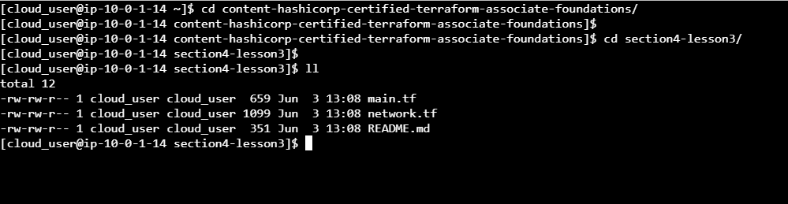

#  Using Terraform CLI Commands (workspace and state)
#### step-1: Clone Terraform Code and Switch to the Proper Directory

Clone the required code from the provided repository by running the command `git clone https://github.com/linuxacademy/content-hashicorp-certified-terraform-associate-foundations.git`.

Switch to the directory where the code is located by running the command `cd content-hashicorp-certified-terraform-associate-foundations/section4-lesson3/`.

List the files in the directory.

The files in the directory should include main.tf and network.tf. These files basically use the ${terraform.workspace} variable to create parallel environments and decide which region the deployment occurs in, depending on the workspace you're in.



#### step-2: Create a New Workspace
Check that no workspace other than the default one currently exists:

terraform workspace list

Create a new workspace named test, using the command `terraform workspace new test`.

You will be automatically switched into the newly created test workspace upon successful completion. Confirm this using the `terraform workspace list` command.


#### step-3: Deploy Infrastructure in the Test Workspace
In the test workspace, initialize the working directory and download the required providers, using the command `terraform init`.

View the contents of the main.tf file using the cat command.
```
provider "aws" {
  region = terraform.workspace == "default" ? "us-east-1" : "us-west-2"
}

#Get Linux AMI ID using SSM Parameter endpoint in us-east-1
data "aws_ssm_parameter" "linuxAmi" {
  name = "/aws/service/ami-amazon-linux-latest/amzn2-ami-hvm-x86_64-gp2"
}

#Create and bootstrap EC2 in us-east-1
resource "aws_instance" "ec2-vm" {
  ami                         = data.aws_ssm_parameter.linuxAmi.value
  instance_type               = "t3.micro"
  associate_public_ip_address = true
  vpc_security_group_ids      = [aws_security_group.sg.id]
  subnet_id                   = aws_subnet.subnet.id
  tags = {
    Name = "${terraform.workspace}-ec2"
  }
}
```

Note the configurations in the main.tf code, particularly:

- AWS is the selected provider.
- If the code is deployed on the default workspace, the resources will be deployed in the us-east-1 region.
- If the code is deployed on any other workspace, the resources will be deployed in the us-west-2 region.
- In the code creating the EC2 virtual machine, we have embedded the $terraform.workspace variable in the Name attribute, so we can easily distinguish those resources   when they are created within their respective workspaces by their name: <workspace name>-ec2.

 View the contents of the network.tf file. 
  ```
  #Create VPC in us-east-1
resource "aws_vpc" "vpc_master" {
  cidr_block = "10.0.0.0/16"
  tags = {
    Name = "${terraform.workspace}-vpc"
  }

}

#Get all available AZ's in VPC for master region
data "aws_availability_zones" "azs" {
  state = "available"
}

#Create subnet # 1 in us-east-1
resource "aws_subnet" "subnet" {
  availability_zone = element(data.aws_availability_zones.azs.names, 0)
  vpc_id            = aws_vpc.vpc_master.id
  cidr_block        = "10.0.1.0/24"

  tags = {
    Name = "${terraform.workspace}-subnet"
  }
}


#Create SG for allowing TCP/22 from anywhere, THIS IS FOR TESTING ONLY
resource "aws_security_group" "sg" {
  name        = "${terraform.workspace}-sg"
  description = "Allow TCP/22"
  vpc_id      = aws_vpc.vpc_master.id
  ingress {
    description = "Allow 22 from our public IP"
    from_port   = 22
    to_port     = 22
    protocol    = "tcp"
    cidr_blocks = ["0.0.0.0/0"]
  }
  egress {
    from_port   = 0
    to_port     = 0
    protocol    = "-1"
    cidr_blocks = ["0.0.0.0/0"]
  }
  tags = {
    Name = "${terraform.workspace}-securitygroup"
  }
}
  ```
  
  
Note the configurations in the network.tf code:
-In the code creating the security group resource, we have embedded the $terraform.workspace variable in the Name attribute, so we can easily distinguish those resources when they are created within their respective workspaces by their name: <workspace name>-securitygroup.
  
Deploy the code using `terraform apply` command.

Once the code has executed successfully, confirm that Terraform is tracking resources in this workspace:

terraform state list
There should be a number of resources being tracked, including the resources spun up by the code just deployed.

Switch over to the default workspace:

terraform workspace select default
Confirm that Terraform is currently not tracking any resources in this workspace, as nothing has been deployed:

terraform state list


Verify that the deployment in the test workspace was successful by viewing the resources that were created in the AWS Management Console.
  
#### step-4: Deploy Infrastructure in the Default Workspace.
Deploy the code again, this time in the default workspace, running the command `terraform apply`.

  
Once the code has executed successfully, confirm that Terraform is now tracking resources in this workspace by ruuning the command `terraform state list`


  
Verify that the deployment in the default workspace was successful by viewing the resources that were created in the AWS Management Console.


