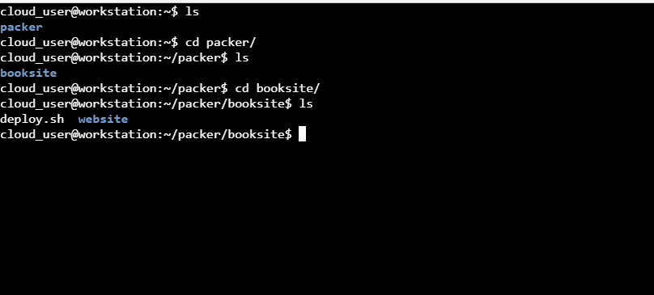
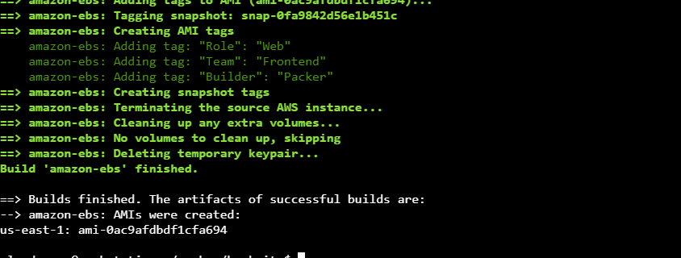

# Building an Amazon EBS-Based Packer Image
#### step-1: Write Template Based on Provided Instructions

In the terminal, change to the packer/booksite directory: `cd packer/booksite/`



Create a file named 'packer.json' and paste the following code in the file:
```
{
    "variables": {
        "aws_access_key": " ",
        "aws_secret_key": " ",
        "aws_subnet_id": " "
    },
    "builders": [
        {
            "type": "amazon-ebs",
            "access_key": "{{user `aws_access_key`}}",
            "secret_key": "{{user `aws_secret_key`}}",
            "region": "us-east-1",
            "subnet_id": "{{user `aws_subnet_id`}}",
            "ami_name": "booksite-amalin2",
            "ami_description": "Landing page for book application",
            "tags": {
                "Builder": "Packer",
                "Role": "Web",
                "Team": "Frontend"
            },
            "instance_type": "t3.micro",
            "source_ami_filter": {
                "filters": {
                    "virtualization-type": "hvm",
                    "name": "amzn2-ami-hvm-2.0.*-gp2",
                    "root-device-type": "ebs"
                },
                "owners": ["amazon"],
                "most_recent": true
            },
            "security_group_filter": {
                "filters": {
                    "tag:Class": "packer"
                }
            },
            "ssh_username": "ec2-user",
            "force_deregister": true,
            "force_delete_snapshot": true
        }
    ],
    "provisioners": [
        {
            "type": "shell",
            "inline": [
                "sudo mkdir -p /var/www/html",
                "sudo chown ec2-user:ec2-user /var/www/html"
                ]
        },
        {
            "type": "file",
            "source": "website/",
            "destination": "/var/www/html/"
        },
        {
            "type": "shell",
            "script": "deploy.sh"
        }
    ]
}
```
Paste the access key id, secret access key and also the subnet_id.

#### step-2: Test the Build

Validate the file, using the command `packer validate packer.json`.

Build the image, using the command `packer build packer.json`.


